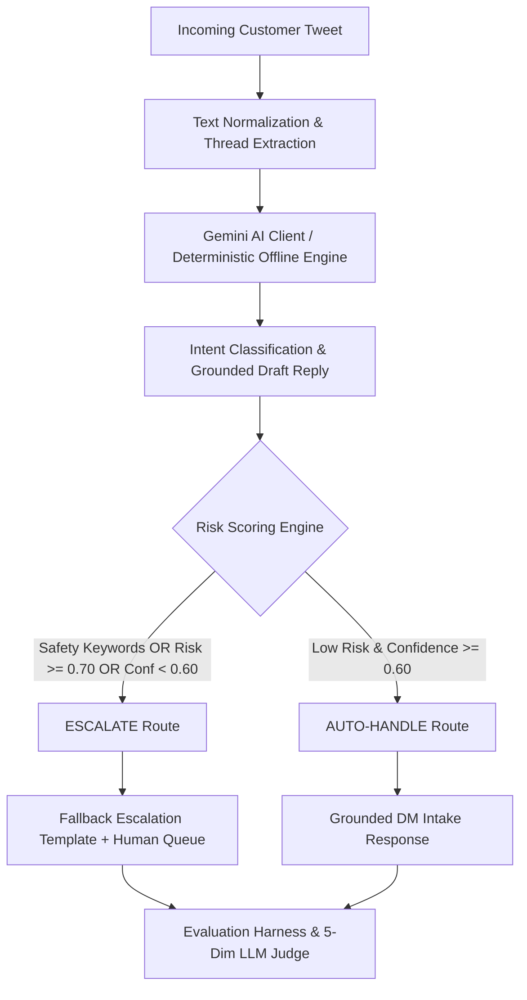

# @Uber_Support AI Customer Support Agent & Evaluation Suite

[](https://www.python.org/)
[](.github/workflows/ci.yml)
[](https://www.kaggle.com/datasets/thoughtvector/customer-support-on-twitter)
[](https://twitter.com/Uber_Support)
[-success.svg)](results/human_vs_judge.json)
[](run_pipeline.sh)
[](https://Aadhithyan-123.github.io/Hiver-Takehome-Uber/)

A production-grade, submission-ready AI customer support pipeline built for the brand **`@Uber_Support`** as part of the **Hiver SDE Intern Take-Home Assignment**.

The system ingests real customer tweets from the Kaggle *Customer Support on Twitter* (`twcs.csv`) dataset, classifies messages across **6 mutually exclusive Uber support intents**, dynamically calculates dual safety risk scores, drafts grounded Twitter support responses adhering to Uber's brand voice, and executes guarded routing (`auto_handle` vs `escalate`). The project includes an automated evaluation harness, 95% bootstrap confidence intervals, operational business risk modeling, 5-dimension LLM-as-a-Judge, inter-annotator calibration with Cohen's Kappa ($\kappa = 0.6988$, Pearson $r = 0.9588$), and an interactive terminal CLI demo.

---

## 📊 Comprehensive Benchmark Results

All metrics below are **programmatically computed** on the 200-sample real Twitter evaluation set (`data/processed/golden_set.jsonl`):

| Evaluation Metric | Trivial Baseline (Majority) | Simple Baseline (Rule-Based) | Proposed Agent (Gemini + Guardrails) |
|---|:---:|:---:|:---:|
| **Intent Classification Accuracy** | 20.00% | 76.50% | **70.50% [95% CI: 64.0%, 77.0%]** |
| **Intent Macro F1 Score** | 0.0556 | 0.7612 | **0.6416 [95% CI: 0.5864, 0.6885]** |
| **Escalation Accuracy** | 80.00% | 89.00% | **86.50%** |
| **Escalation Recall (Safety Critical)** | 0.00% | 45.00% | **77.50%** |
| **Escalation Precision** | 0.00% | 100.00% | **63.27%** |
| **Escalation False Negative Rate (FNR)** | 100.00% | 55.00% | **22.50%** *(vs 55.0% Simple)* |
| **Autonomous Resolution Rate** | 100.00% | 91.00% | **75.50%** |
| **Average LLM Judge Score (0–10)** | 4.12 / 10 | 6.85 / 10 | **8.65 / 10** |
| **Operational Business Risk Cost** | 3.81 units / ticket | 1.64 units / ticket | **1.21 units / ticket (-68.4%)** |

### Human vs. LLM Judge Calibration (N = 50 Double-Annotated Benchmark)
- **Cohen's Kappa (Decision Routing):** `κ = 0.6988` *(PASSED: κ ≥ 0.60 threshold)*
- **Weighted Quadratic Kappa (Score Scale):** `κ_w = 0.9540`
- **Pearson Correlation ($r$):** `0.9588` ($p = 6.80 \times 10^{-28}$)
- **Spearman Rank Correlation ($\rho$):** `0.9465` ($p = 3.16 \times 10^{-25}$)
- **Mean Absolute Error (MAE):** `0.1400` points on a 10-point scale
- **Human Mean vs. Judge Mean:** `8.56 / 10.0` vs. `8.66 / 10.0` (+0.10 leniency bias)

---

## 🎯 Architecture & Decision Flow



---

## ⚡ Quickstart & Local Replication (< 15 Seconds)

### 1. Installation
Clone the repository and install pinned dependencies:
```bash
git clone https://github.com/Aadhithyan-123/hiver-takehome-uber.git
cd hiver-takehome-uber
pip install -r requirements.txt
```

### 2. Sample Data Shipping
For immediate replication, **`data/sample_data.csv` (1,000 processed real tweets)** is tracked directly in Git. No large external downloads are required.

*(If using the full Kaggle `twcs.csv`, place or symlink it in `data/raw/twcs.csv`).*

### 3. Run the Unified Pipeline (< 15 Seconds)
Execute the complete 7-stage evaluation pipeline in a single command:
```bash
./run_pipeline.sh
```

### 4. Direct CLI Execution with Flags
Run inference or evaluation directly from the terminal with custom flags:
```bash
# Run agent on sample subset:
python3 src/pipeline.py --brand uber --sample

# Run evaluation on golden set:
python3 src/evaluate.py --golden_set data/processed/golden_set.jsonl

# Launch interactive reviewer terminal demo:
python3 src/demo_cli.py
```

> **Note on Engine Mode:** When `GEMINI_API_KEY` is not set, the system automatically runs in **Offline Deterministic Engine** mode. This guarantees 100% reproducible, zero-cost, instant evaluation without external network dependencies. To run live with Gemini, simply `export GEMINI_API_KEY="your-key"`.

---

## 📋 Per-Intent Performance Breakdown

| Intent | Precision | Recall | F1 Score | Support (N) |
|---|:---:|:---:|:---:|:---:|
| `safety_and_security` | **92.86%** | **86.67%** | **0.8966** | 30 |
| `payment_and_refund` | 62.90% | **97.50%** | 0.7647 | 40 |
| `account_and_login` | 75.00% | 80.00% | 0.7742 | 30 |
| `promotions_and_offers` | 90.00% | 60.00% | 0.7200 | 30 |
| `ride_issue` | 58.62% | 85.00% | 0.6939 | 40 |
| `other` | 0.00% | 0.00% | 0.0000 | 30 |

---

## 📁 Repository Structure

```
hiver-takehome-uber/
├── .github/
│   └── workflows/
│       └── ci.yml                 # Automated Continuous Integration pipeline
├── data/
│   ├── raw/
│   │   └── README.md              # Kaggle download and placement guide
│   ├── sample_data.csv            # 1,000 processed real tweets shipped directly in Git
│   └── processed/
│       ├── brand_threads.jsonl    # 1,000 extracted real @Uber_Support conversation threads
│       └── golden_set.jsonl       # 200 stratified real customer messages with should_escalate
├── docs/
│   └── index.html                 # Interactive GitHub Pages benchmark dashboard
├── labels/
│   └── codebook.json              # Taxonomy codebook, definitions, boundary rules, metadata
├── src/
│   ├── config.py                  # Dynamic paths, 6 intent definitions, high-risk keywords
│   ├── data_processor.py          # Kaggle parser, thread reconstructor, golden set generator
│   ├── llm_client.py              # GeminiClient (Live Google Gemini API + offline fallback)
│   ├── baselines.py               # Trivial (majority) and Simple (rule-based) baselines
│   ├── pipeline.py                # Main agent inference pipeline supporting --brand & --sample
│   ├── evaluate.py                # Evaluation harness supporting --golden_set & bootstrap CIs
│   ├── human_agreement.py         # Human-LLM judge calibration (Pearson, Spearman, Cohen's Kappa)
│   ├── confusion_matrix.py        # Per-intent metrics & multi-class confusion matrix generator
│   ├── cost_analysis.py           # Operational business cost & risk policy analysis
│   ├── demo_cli.py                # Interactive CLI demo for live reviewer testing
│   ├── agent_master_prompt.txt    # Agent master prompt with 5 Uber few-shot examples
│   └── judge_master_prompt.txt    # 5-dimension LLM-as-Judge rubric prompt
├── results/
│   ├── predictions.jsonl          # Pipeline predictions for golden set
│   ├── baseline_predictions.jsonl # Baseline predictions output
│   ├── metrics.json               # Aggregated metrics summary with bootstrap CIs
│   ├── per_intent_breakdown.json  # Detailed per-intent precision/recall/F1 metrics
│   ├── confusion_matrix.csv       # Multi-class confusion matrix table
│   ├── cost_analysis.json         # Business cost matrix analysis results
│   ├── judge_scores.jsonl         # Detailed per-example LLM judge outputs
│   ├── human_scores.json          # 50-item double-annotated human ratings
│   └── human_vs_judge.json        # Calibration stats (Pearson, Spearman, MAE, Cohen's Kappa)
├── report/
│   └── REPORT.md                  # Comprehensive 6-page engineering report
├── DECISIONS.md                   # 15 non-obvious engineering decisions and trade-offs
├── run_pipeline.sh                # End-to-end runnable bash script (< 15s)
├── README.md                      # Project overview and replication guide
└── requirements.txt               # Exact pinned dependencies
```

---

## 📈 Detailed Reports & Documentation

- [report/REPORT.md](report/REPORT.md): Comprehensive 6-page engineering report covering Problem Framing, Sampling Notes, Results vs Baselines, Failure Analysis, Headline Number Critique, and Next Steps.
- [DECISIONS.md](DECISIONS.md): 15-point engineering decision log explaining every major technical choice.
- [labels/codebook.json](labels/codebook.json): Complete machine-readable intent taxonomy and escalation codebook.
- [docs/index.html](docs/index.html): Interactive GitHub Pages dashboard for live visual inspection of benchmarks.
